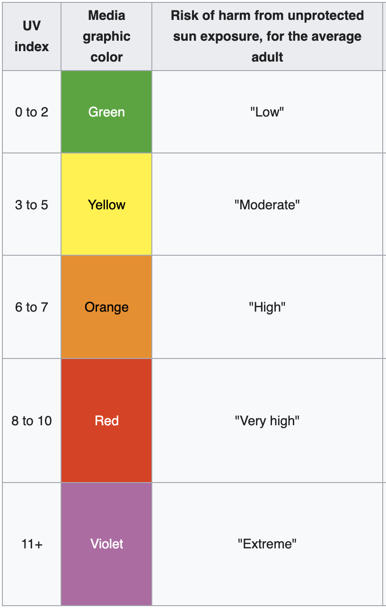
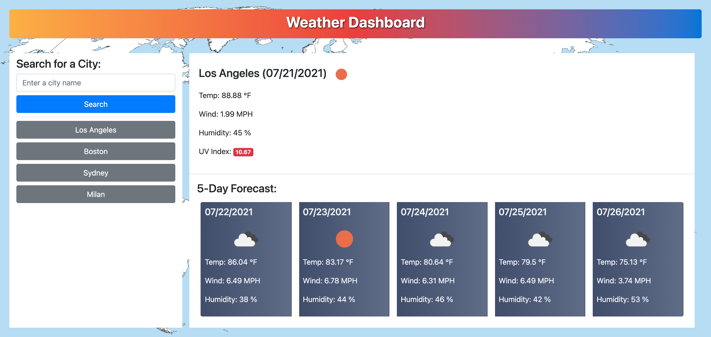

# City Weather Dashboard

A weather dashboard that uses the OpenWeather One Call API to show current weather and 5-day forcast for a city
## Technologies Used

* HTML
* CSS
* JavaScript powered by jQuery
## Description 

Use this app to see the weather outlook for multiple cities. Search for a city and you will be presented with current and future conditions for that city and that city will be added to the search history. The weather info contains city name, the date, an icon representation of weather conditions, the temperature, the humidity, the wind speed, and the UV index. UV index is colored to indicate the risk of harm from unprotected sun exposure according to this table:

## Usage 
​
To search for a city input a city name and click "Search". Click on a city button in the search history to see current and future weather conditions for that city again.
## Page View

| 
## Link

Link to deployed application https://irina-golubitsky.github.io/City-Weather-Dashboard/

---
MIT License
Copyright (c) [2021] [Irina Golubitsky]